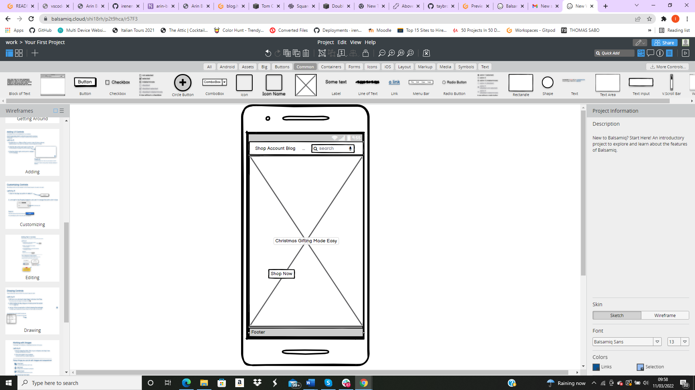
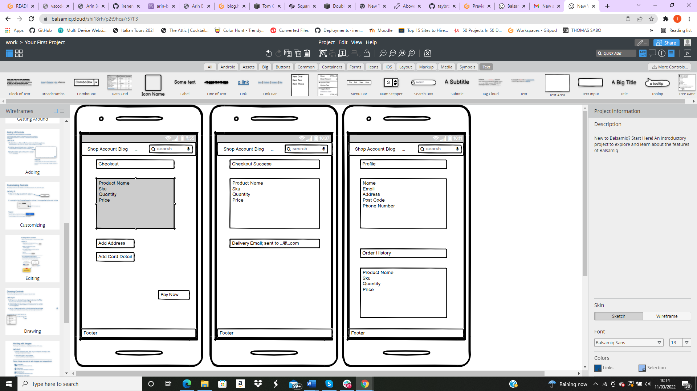
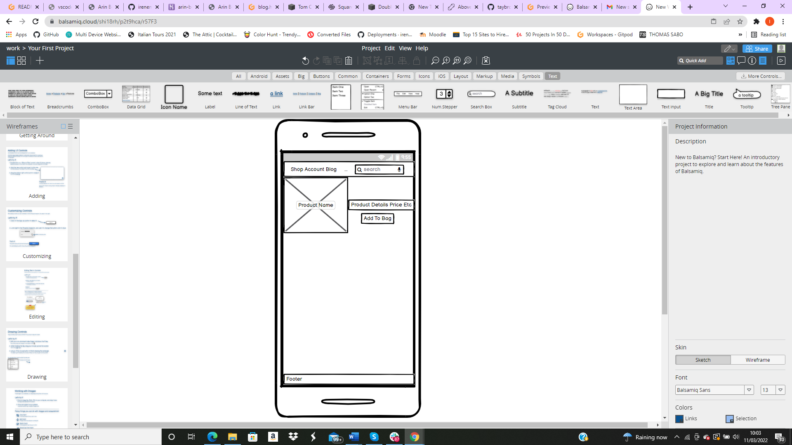
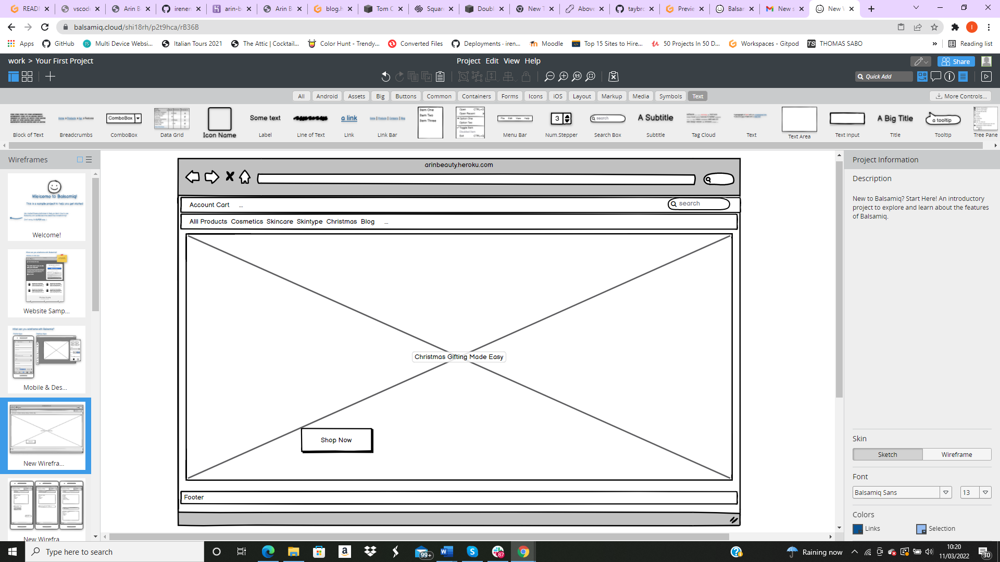
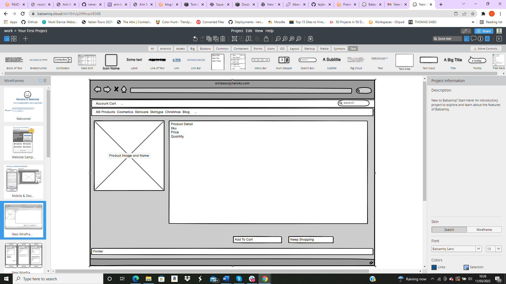
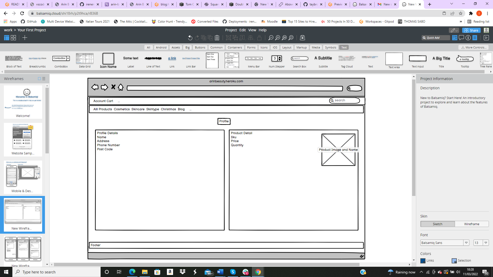

Visit the live site here: (https://arin-beauty.herokuapp.com/)


# Educational Purposes
This website is for educational purposes and checkout functionality is set up to accept stripe test card details. Please don't enter your personal card details.

To process a test stripe payment at checkout, please use the following details.

card number : 4242 4242 4242 4242
Any date
Any CVV number


# Mission Statement
- To provide an easily accessible site for the promotion and sale of beauty products. To showcase the Arin Beauty Products Company and its history and sustainability.

# Target Audience
- The target audience for ARIN Beauty Products is consumers who love to find all their beauty needs met in one effective site. Here they can find beauty products for sale, makeup tutorials, reviews and more. They can make a profile, have an order history and leave comments on the blog.

# Table Of Contents
## 1. [User Experience (UX)](#ux-design)
   * [Strategy](#strategy)
   * [Scope](#scope) 
   * [Structure](#structure)
   * [Strategy](#strategy)
   * [Skeleton](#skeleton)
   * [Surface](#surface)
## 2.[Information Architecture](#information-architecture)
   * [Database](#database)
   * [Data Model](#data-model)
## 3.[Technologies Used in the project](#technologies)
  * [Languages](#languages)
  * [Databases ](#databases)
  * [Libraries and frameworks](#libraries-and-frameworks)
  * [Other technologies](#other-technologies)  
## 4.[Testing]()
  * Located in a seperate testing file.
## 5.[Deployment](#deployment)
  * [Deployment of the site](#site-deployment)
  * [How to run the code locally](#how-to-run-locally)
## 6.[Credits](#credits)
  * [Code](#code)
  * [Content](#content)
  * [Media](#media)
## 7.[Acknowledgment](#acknowledgments)

## [USER EXPERIENCE (UX)](#ux-design)
- ## [Strategy](#strategy)

  -  ## [Business Goals](#business-goals)
      * From a business point of view, I would like to have an attractive, trustworthy and fully functional website that is responsive on all devices.
      * I wish to have a website that immediately makes clear the purpose of it. In this case a website selling beauty products.
      * Products on the website can be easily modified using CRUD(create, read, update, delete) by the admin.
      * Users can easily register an account to promote revisits to the site.
      * An account will not be required however to visit the site, therefore maximizing the potential customer base.
      * Hold and secure information from all current and new customers so they may login to place orders.
      * I want to promote revisits by allowing customers who have purchased items to leave reviews and ratings.
      * I want a site that is easy to navigate using a search bar which will search using a product name or description.
      * I want the user to have the ability to break all products down into smaller categories. Such as eyes, face etc so it has high functionality and an overall high UX experience.
      * A trustworthy, safe and secure checkout and payment system to reassure customers that their private information is safe when used on this site.
      This is essential as no matter how good a product is if the payment system looks unsafe chances are I will lose sales and visits.

- ### [User Stories](#user-stories):
   
   - #### As a Shopper:
      1. I want to be able to view a list of products which relate to what I am searching for. E.g: moisturizer.
      2. I want to be able to select an individual product and access more information on that product. For example, an item which when clicked on will bring up a seperate page featuring an image, a description and a rating for the product I have clicked on.
      3. I want to be able to sort through the entire list of available products by breaking them into different categories. Example: eyes, face, lips etc.
      4. To make the site more user friendly I would like to be able to sort through the entire product content by rating, price low to high, price high to low, alphabetical order etc. This way I can quickly navigate to the item I am searching for.
      5. I would like to read reviews left by other customers who have purchased the same item.
      6. I also want to quickly search through the site. A search bar would help me easily navigate using a product name or description.
      7. My search results being at the top of the page would make usage clear and efficient.
      8. Should I decide to buy the product a clear 'Buy Now' button will be needed.
      9. A button to easily increase and decrease the quantity of the product I wish to buy is required.
      10. In the shopping cart I would like to see a running total so I can control my spending and avoid any nasty shocks caused by going over budget.
      11. Ability to edit quantity of items in the basket would increase the overall functionality of the site.
      12. The shopping cart should also feature a 'Continue Shopping' button.
      13. Once I've finished shopping I'd like to easily checkout and pay for my purchases.
      14. I want a payment method and process that is trustworthy, safe and secure.
      15. For added peace of mind, the ability to confirm my order before checkout to avoid mistakes. Example: ordering too high a quantity of a particular item.
      16. I want to recieve an email with confirmation of my order after purchase.
      17. After I have recieved my product, I want to be able to revisit the site to leave a review and a rating so other customers can benefit from my experience.

- ### As a site user:
     1. I would like the option to create an account for use on this site but as I might just want to browse I dont want this to be mandatory to access the sites content.
     2. Should I create an account I would like to easily login and logout to access my personal account info on my personalised account.
     3. I would like to receive an email confirmation after registering to be able to verify that registration was successful.
     4. I'd like to be able to easily recover my password incase I forget it so that I can recover access to my account.
     5. I'd like my profile to include my order history, order confirmation and the option to save my payment information.

- ### As a Store Owner:
     1. As admin , I want to have control of CRUD. I want to add new products when I choose.
     2. I want to edit and update a product when needed. Example: new make-up colours added etc.
     3. I want to be able to delete products when needed. Example: discontinued. Low sales due to negative reviews etc.


## [SCOPE](#scope)
The key features of the website is developed based on the user stories:
### For any site user:
 * A clear aim of the site. The home page features an image that shows some beauty products.
 * The logo in this case features the word beauty to highlight the products sold by the company.
 * The home page also features a banner which high-lights that delivery is free on orders above the amount shown.
 * A clear products page where users can view all items when the all products option is selected.
 * Clear pages to show each category when selected.
 * When the search bar is utilized, the top searches will be at the top of the page to maximize UX.
 * Product Detail page with detailed information about the selected product, this page will also be used to select the product for purchase and for increasing and decreasing the quantity required.
 * Shopping cart page, here customers can view their selected products for purchase. Edit quantity required and confirm their order before checkout.
 * Checkout page, allowing users to purchase products safely and securely.
 * Confirmation page which will show customers that their order was successful. An email will also be sent to the customers email account given while purchasing.
 * Contact page which can be used to contact the company when required.
 * About us page, where users can find the mission statement of the company.
 * A section where customers can review products that they have purchased.
 * A sign up page where users can register for an account. Here they will be able to veiw purchase history and have a personalised account.

## For registered users:
* Profile page, where users can update the default delivery information allowing ease of checkout.
* Users can see their order history from their profile page.
* Here customers can also leave a product review.
* Log out page, where users can securely log out of their page.

### For Store Owner:
  1. I would like to be able to add new products to the store.
  2. I would like to be able to edit and update a product from the store.
  3. I would like to be able to delete a product from the store.
  4. I would like to be able to delete reviews from users such as abusive or offensive messages left.
  5. Having control of CRUD will allow me to keep the site up to date and maintain a high standard of customer service.

## [STRUCTURE](#structure)
## Existing Features:
### Allauth features
The sign up, register, password reset, email confirmation pages etc, have all been provided by Django allauth and formatted to suit the needs of the site.
### Base Template
* Delivery Banner - The delivery banner contains information about free delivery and the free delivery threshold. It is fixed to the top of the screen to allow for ease of access and improved user navigation. It will change color when hovered over to make it stand out more.
* Along the top of the screen is a search bar. This will use Q to search through products using names and/or descriptions.
* Also along the top of the site the user will find links that will take users to different parts of the site which are as follows:
 * Unregistered user:
   * Login link
   * Register link
 * Registered user:
   * Wishlist
   * My Account - Profile, Logout
   * Cart
 * Admin/ superuser
   * Wishlist
   * My Account - Product Management, Profile, Logout
### Navbar
The navbar will have all the product category links and is fully adjustable across screen sizes.
* All Products - here products may be sorted and selected based on rating, price and categories.
* Cosmetics
    - Face
    - Eyes
    - Lips
    - All Cosmetics
* Skin Type
    - Sensitive
    - Dry
    - Oily
    - Combination
    - All Skin Types
* Skin Care
    - Moisturiser
    - Cleanser
    - Serum
    - All Skin Care
* Christmas
    - Gift Sets
* Blog
    - Our Story
### Blog Navbar
The main site navbar leads to a blog. When the blog button is clicked it leads to a new navbar and dropdown menus. The blog is a place where the sustainability promise to customers is shared along with a brief history of the company and introduction to the team.
Here, users can also access makeup tutorials, read reviews of products and leave comments. For now adding and deleting blog posts is only for authenticated users(admin.) In later edits of the site the ability to add posts will be made public but deletion will still be admin only.
* Blog
    - Blog Content
* About Us
    - About Us
* Categories
    - Foundation
    - Makeup Tutorials
* Makeup Tutorials
    - Videos
* Sustainability Promise
    - Our Promise

### Home
* Hero image and text to highlight use of site. Shop now button which connects to the all products page and gives users a view of what is on offer. 
### Products
* Featured images at the top of each main category page
* Product Category buttons so the user can select which sub-category they would like to look at
* Basic filtering options to sort products by category, name, price etc.
* Basic product info is displayed to the user such as the product image, name, price, category link, and for admins, edit/delete buttons
* Users can click on the product images which will take them to the product details page for that particular product
### Product Detail
* Breadcrumb links feature on these pages
* Product details shown to user; image, name, price, edit/delete buttons for admins and description
* Quantity selector that allows the user to choose the quantity they would like to purchase
* Keep Shopping button that takes the user back to the products page
* Add To Bag button that adds the product to the users shopping bag
* Review section with user reviews that can be viewed by all users regardless of registered status
* If a user is an admin they can edit/delete products. They can add products via product management.
### Shopping Bag
* Shows the user the product/s that they have in their bag
* Displays product image, name, size, SKU
* Quantity selector allows user to see how many they have in their shopping bag and amend that amount
* Subtotal shows the cost of the product, reflects changes upon quantity amendments
* Bag total, delivery and grand total show these amounts to the user
* Keep Shopping button allows the user to navigate back to the products page
* Secure Checkout buttons takes the customer to the Checkout page
### 404/500 Pages
* Page displayed when 404/500 error occurs
* Large text to display there is an error to the user
* Back To Home button so the user can navigate back to the home page
### Back To Top Button
 * Due to the large volume of the site a back to top button is required for easy navigation throughtout.
### Footer
The footer has all the important shop information such as opening hours, contact details and all the important heading links.
### Admin Features
  * Admin will have access to additional features across the site not accessible to other users.
### Post comments
 - Adding post comments would be a good way for users to interact with the admins of the site who have created the posts. They would also be able to add any additional info, or views and opinions on the posts. 
### Reviews
 - For users to review products
### Blog
 - For admin to post blogs and tutorials. Users can leave a comment under blog posts.
### Future Development Opportunities
* An add to favourites section/wishlist section for users to save their favourite products to purchase later.
* For the admin to be able to offer 'recommended products' to registered users based on past purchases in their order history.
[Structure](#structure)
Information Architecture

Database diagram made using [dbdiagram.io](https://dbdiagram.io/).


Products Models
Products App -
  Product: Holds the information for each individual product.
  Category: Holds the available categories for the products.

Review - related to Product and User. Stores Product Reviews. A Django signal updates the Product rating field when a review is added, deleted or edited.

Checkout Models
 - Order - related to OrderLineItem and UserProfile. Stores Orders after successful checkout. Order order_number field is automatically added on save.
 - Order discount, order_total, previous_total, delivery and grand_total fields are automatically updated using a Django signal when an - - -  - OrderLineItem is added or deleted.

 - OrderLineItem - related to Order, Type, Product and Size. Stores each OrderLineItem after successful checkout.
 - OrderLineItem line_item_total field is automatically calculated on save.

Profiles Models

 - UserProfile - related to Order and User. Stores default delivery information. UserProfile is automatically created or updated using a Django receiver when a User object is updated or created.
 - Order History is stored in the user profile aswell.

Cart Models
Cart - related to User. Stripe webhooks.
 - Products App
    - Product: Holds the information for each individual product.
    - Category: Holds the available categories for the products.
    - Product Variations: Any variations of a specific product (sizes etc)

User
  - Created with django allauth containing the customer username, email and password.

User Profile App
  - User Profile: Holds user default delivery information

Admin Product Management
  - Add product form for admin to input a new product to the store.
  - If 'has variations' is selected, submitting the form will redirect the admin to add variations of the product.
  - Add product variations page displays existing variations and offers the admin the ability to add additional variations as well as edit and delete existing variations.

    

    

Messages/Toasts
 - Messages and Toasts are used when executing certain actions on the site, such as logging in and out, adding and removing products from the shopping bag, completing a transaction, and for admin actions too like adding and editing products.
## [Skeleton](#skeleton)
 - Wireframes
 
 
 
 
 
 
## [Surface](#surface)
### Colours
 - For the shopping pages I used a simple black and white theme with a gold banner which changes to silver when hovered over. This banner was taken from w3schools and adapted to suit my needs.
 - All products/checkout/sign up etc pages are white to help keep the site simple and user friendly.
### Images
 - The site header has an image of snow falling. This was used to create a christmas feels to the site. This effect was created using using online tutorials on youtube. ('online tutorials' is the company name). I got an image of snow from unsplash.com and used to video to add a motion effect.
 -  Some images were taken from freepik and the rest were taken from unsplash.com
 - For the blog pages I used images to create a warmer feeling background. I used images from unsplash to create this effect.
 - On the home page the logo is used to welcome people to the site. I got this logo made on fiverr.com.
 - On the main store page I used a large background image to welcome people to the site. The image is off christmas presents. There is a large 'shop now' button displayed here which connects to the products page.
### Fonts
 - Fonts were taken from Google Font 'Lato' and 'Damion'
 - Icons from Font Awesome.
google font for fonts and font awesome for icons


### Technologies
#### Integrated Development Environment
* GitHub
* Heroku

## Languages Used
- [Python3](https://www.python.org/downloads/)
- [JavaScript](https://www.javascript.com/)
- [CSS3](https://en.wikipedia.org/wiki/CSS)
- [HTML5](https://en.wikipedia.org/wiki/HTML5)

## Django and Associated Extensions

- [Django](https://www.djangoproject.com/)
    - Django was was used to create the project and code infrastructure. Django templating language was used when passing data between the Front-end and Back-end.

- [Django Allauth](https://django-allauth.readthedocs.io/en/latest/installation.html)
    - Allauth was used to create user registration and login functionality.

- [Django Countries](https://pypi.org/project/django-countries/)
    - Django Countries was used for formatting of the 'Country' field in the checkout form and in the default user info within the profile section.

- [Django Crispy Forms](https://django-crispy-forms.readthedocs.io/en/latest/)
    - Used to format the default django form fields across the site.


- [Django Coverage](https://pypi.org/project/django-coverage/)
    - Used to monitor coverage of automation testing written for the product, product_review and wishlist apps.

- Database

#### Development - SQLite
* Deployed site - Heroku PostgreSQL
#### Storage
* Amazon AWS S3 - used to store static files.
#### Payments
* Stripe - fully integrated payments platform.
#### Frameworks
* Django - web development framework.
* Bootstrap - to assist with responsive design.
* jQuery - to assist with JavaScript coding and DOM manipulation.
#### Tools & Libraries
* Balsamiq - used to produce Wireframes.
* Font Awesome
* Google Fonts
* django-allauth - user authentication and account management.
* boto3 - Amazon Web Services SDK for python. Used to configure Amazon Web Services S3 storage of static files.
* django-crispy-forms - enables enhanced rendering of Django forms including integration with Bootstrap.
* dj-database-url - Django database configuration utility. Used to configure connection to the Heroku deployed postgres database.
* django-countries - Django application providing country choices for use with forms etc. Used to populate country choices on the Country dropdowns.
* django-extensions - Collection of custom extensions for Django. Used to automatically export the final data schema diagram for the Django model.
* django-storages - Custom storage backends for Django. Used to configure Amazon Web Services S3 storage of static files.
* gunicorn - Python WSGI HTTP Server for UNIX. Used as part of the Heroku deployment process.
* pillow - Python imaging library.
* psycopg2 - PostgreSQL database adapter for Python. Used as part of the Heroku deployment process.
* pydot - Graphviz interface used to parse the Django data model into a .dot file using django-extensions.
* Flake8 - for python code validation.
* flake8-django - Flake8 plug-in for Django, for python code validation.
* LAMBDATEST - cross browser testing cloud, for testing across multiple browsers and operating systems.

Browser Support
Arin Beauty Products supports the following browsers:

* Google Chrome
* Microsoft Edge
* Safari
* Firefox
* Opera
### Full Deployment method
# Testing

Find the full Testing Document [here!](TESTING.md)

[Back to Contents](#table-of-contents)

# Deployment

Below is the process to deploy the site using Heroku, and to set up and store the images and static files in AWS;

## Heroku

•	Go to [Heroku](https://www.heroku.com)

•	Create an account if you don’t have one already, log in if you do

•	Create a new app, making sure to use only lower case letters and no spaces for the name

•	Choose the region closest to you and select “Create App”

---

•	When the app has been created, click on the “Resources” tab to add the Postgres database

•	Type in “Heroku Postgres” and select it from the dropdown list

•	This will automatically create a DATABASE_URL variable in Heroku Config Vars which can be found by clicking on the “Settings” tab, and clicking the “Reveal Config Vars” button

•	Now head over to the “Deployment” tab to set automatic deployments when pushing to GitHub

•	Set the deployment method to “GitHub” and search for your repository

•	Click “Connect”, then “Enable automatic deployments”

---

•	Back in your IDE, install both `dj_database_url` and `psycopg2-binary` in order to use Heroku Postgres

•	In your `settings.py` file, comment out the existing sqlite DATABASES and add the following code;
```
DATABASES = {
	‘default’ = dj_database_url.parse(‘database_url')
}
```

---

•	Login to Heroku within your IDE by typing `heroku login –i`

•	Once logged in, you will need to run migrations to migrate your models to Postgres;

•	In the terminal, enter `heroku run python3 manage.py migrate --plan` to show what will be migrated

•	If you are happy with the migrations, enter `heroku run python3 manage.py migrate`

•	If you are using a JSON file with product information stored, you will need to load these to Heroku also by entering the following into your terminal;

`heroku run python3 manage.py loaddata categories`

`heroku run python3 manage.py loaddata products`

•	Make sure to also create a super user so you can access the admin page by entering `python3 manage.py createsuperuser`

•	If you haven’t already, you will need to create a `requirements.txt` file and a `procfile`

•	Install `gunicorn` and make a create your `requirements.txt` by entering `pip3 freeze > requirements.txt` in your terminal

•	Create a `procfile` by entering the following into your terminal;

`web: gunicorn name_of_your_app.wsgi:application`

•	Before committing and pushing these changes to GitHub, make sure you uncomment your `DATABASES` code in `settings.py` and amend your code to ensure your database url doesn’t get accidentally committed to GitHub!

•	Once this is done, `add`, `commit` and `push` your changes to GitHub

---

IMPORTANT!

Make sure that all of your configuration variables are up to date on Heroku such as any secret keys to ensure your app works as intended! Your Config Variables should look similar to this (These variables also include ones for AWS which the following section will go over);

| Key                   | Value                    |
| --------------------- |--------------------------|
| AWS_ACCESS_KEY_ID     | `aws_access_key`         |
| AWS_SECRET_ACCESS_KEY | `aws_secret_access_key`  |
| DATABASE_URL          | `auto-generated`         |
| EMAIL_HOST_PASS       | `email_key`              |
| EMAIL_HOST_USER       | `your_email`             |
| SECRET_KEY            | `secret_key`             |
| STRIPE_PUBLIC_KEY     | `your_stripe_public_key` |
| STRIPE_SECRET_KEY     | `your_stripe_secret_key` |
| STRIPE_WH_SECRET      | `stripe_webhook_key`     |
| USE_AWS               | `True`                   |

---

## AWS

### Setting Up

1. Go to AWS and set up an account if you don’t already have one. You will be asked to enter credit/debit card details, but whilst you are using the free tier you should not need to make any payments. Please keep an eye on your usage though to avoid any charges!

2. Log in to AWS, and navigate to S3. You can search for “S3” in the search bar at the top of the screen. 

3. Create a new bucket by clicking on the orange “Create Bucket” button. 

4. Make sure that your bucket name matches the name of your app on Heroku, and that you select the region closest to you. 

5. Scroll down to “Block Public Access settings for this bucket” and uncheck the checked box. Confirm that you are happy to do this, then scroll to the bottom of the page and click the orange “Create Bucket” button. You will be taken to your bucket dashboard, and from here, you will need to make some amendments to your bucket. 

---

### Bucket Properties

1. Click on the “Properties” tab and scroll down to the bottom of the page, where you will find a “Static website hosting” section. Click on the edit button.

2. The top section will allow you to choose between “Disable” or “Enable”, and you will want to select “Enable” to enable static website hosting. 

3. The section below is “Hosting Type”. Select “Host a static website” and scroll down to the “Index Document” inputs. 

4. It will first ask you to specify the home or default page, which is `index.html`

5. It will then give you the option of entering an error link for if an error occurs. In the input, type `error.html`

6. Leave the Redirection rules blank, and click the orange “Save Changes”. 

---

### Setting Permissions

1. Next, click on the “Permissions” tab, scroll to the bottom of the page and click edit in the “Cross-origin resource sharing (CORS)” section. 

2. Add in the following code, making sure to use correct indentation;

```
[
    {
        "AllowedHeaders": [
            "Authorization"
        ],
        "AllowedMethods": [
            "GET"
        ],
        "AllowedOrigins": [
            "*"
        ],
        "ExposeHeaders": []
    }
]
```

3. Click on the orange “Save Changes” button and navigate to the “Bucket Policy” section which will be near the top of the page, and click edit. 

---

### Generating A Bucket Policy

1. Click on the “Policy Generator” button. This will open a new window. 

2. Within that new window will be a series of steps. For step one, you will need to select “S3 Bucket Policy from the dropdown list.

3. In step two, you will need the following options set;

    - Effect – Allow
    - Principle - *
    - Actions – GetObject, GetObjectAcl, PutObject, PutObjectAcl and DeleteObject
    - Amazon Resource Name (ARN) – This will be found on the previous page, under “Bucket ARN”. Copy this and paste it into this box

4. After these have been entered, click “Add Statement” then “Generate Policy”.

5. Copy the policy into the bucket policy editor, adding `/*` onto the end, the click “Save Changes”.

---

### Access Control List (ACL)

1. Staying in the permissions tab, click edit under the “Access Control List (ACL)” section. 

2. You will be shown a series of options and tick boxes. Navigate to “Everyone (public access)” and tick the box on the left, “List” under the “Objects” heading. You will need to agree that you understand the effects before you can save, so tick that, then click on “Save Changes”.

---

### IAM - Creating A Group and Policy

1. Next, search for IAM in the search bar at the top, and click on it to set up a group policy.

2. Under “Access Management” on the left hand side, click on “User Groups” and create a new group.

3. Give the group a name and click “Create Group”. 

4. This will take you back to the IAM dashboard. Go back to the “Access Management” section on the left hand side, and click on “Policies”. 

5. Click “Create Policy” and head over to the JSON tab, and select “Import Managed Policy”. 

6. Search for and click on “AmazonS3FullAccess” then “Import”.

7. Copy your ARN and place it in the code so that it looks like the below;

```
{
    "Version": "2012-10-17",
    "Statement": [
        {
            "Effect": "Allow",
            "Action": [
                "s3:*",
                "s3-object-lambda:*"
            ],
            "Resource": [
                "arn:aws:s3:::YOUR-ARN",
                "arn:aws:s3:::YOUR-ARN/*"
            ]
        }
    ]
}
```

8. Click on “Next: Tags”, “Next: Review”, put in a name and click on “Create Policy”. 

---

### Group Policy

1. Next, you will need to attach the Policy to the Group created.

2. Go to “User Groups” on the left hand side menu, under “Access Management”.

3. Click on the your newly created group and go over to the “Permissions” tab.

4. Click on the “Add Permissions” button, and select “Attach Policy”.

5. Search for and click on the checkbox next to the policy you have just created, then click “Add Permissions”.

---

### IAM - Create User

1. Back at the IAM dashboard, click on “Users” on the left hand side menu, then “Add User”.

2. Choose a name and tick the checkbox to give the user access, then click “Next: Permissions”.

3. Select the group to put the user in and keep clicking the next buttons until the very end and click “Create user”.

4. Click on “Download .csv” file and make sure you save this somewhere you remember, as you will not have access to this page again! This file will contain information such as your access codes (shown above in the Heroku Deployment section).

---

### **Important!**

Make sure to also update your settings.py file to reflect the changes to the database! It should look something like this;
```
if 'USE_AWS' in os.environ:
    AWS_STORAGE_BUCKET_NAME = 'your_bucket_name'
    AWS_S3_REGION_NAME = 'eu-west-2'
    AWS_ACCESS_KEY_ID = os.environ.get('AWS_ACCESS_KEY_ID')
    AWS_SECRET_ACCESS_KEY = os.environ.get('AWS_SECRET_ACCESS_KEY')
    AWS_S3_CUSTOM_DOMAIN = f'{AWS_STORAGE_BUCKET_NAME}.s3.amazonaws.com'
```
### How To Save Images To The S3 Bucket

If you need to save images to your S3 bucket, you will need to do the following;

1. Go back to the S3 dashboard, and click on your bucket. 

2. Click “Create Folder”, call it ‘media’ and confirm with the second “Create Folder” button.

3. When you are in this folder, click “Upload”, then “Add Files” or “Add Folder”, then “Upload”.


[Structure](#structure)
Information Architecture

Database diagram made using [dbdiagram.io](https://dbdiagram.io/).


Products Models
Products App -
  Product: Holds the information for each individual product.
  Category: Holds the available categories for the products.

Review - related to Product and User. Stores Product Reviews. A Django signal updates the Product rating field when a review is added, deleted or edited.

Checkout Models
 - Order - related to OrderLineItem and UserProfile. Stores Orders after successful checkout. Order order_number field is automatically added on save.
 - Order discount, order_total, previous_total, delivery and grand_total fields are automatically updated using a Django signal when an - - -  - OrderLineItem is added or deleted.

 - OrderLineItem - related to Order, Type, Product and Size. Stores each OrderLineItem after successful checkout.
 - OrderLineItem line_item_total field is automatically calculated on save.

Profiles Models

 - UserProfile - related to Order and User. Stores default delivery information. UserProfile is automatically created or updated using a Django receiver when a User object is updated or created.
 - Order History is stored in the user profile aswell.

Cart Models
Cart - related to User. Stripe webhooks.
 - Products App
    - Product: Holds the information for each individual product.
    - Category: Holds the available categories for the products.
    - Product Variations: Any variations of a specific product (sizes etc)

User
  - Created with django allauth containing the customer username, email and password.

User Profile App
  - User Profile: Holds user default delivery information

Admin Product Management
  - Add product form for admin to input a new product to the store.
  - If 'has variations' is selected, submitting the form will redirect the admin to add variations of the product.
  - Add product variations page displays existing variations and offers the admin the ability to add additional variations as well as edit and delete existing variations.

    

    

Messages/Toasts
 - Messages and Toasts are used when executing certain actions on the site, such as logging in and out, adding and removing products from the shopping bag, completing a transaction, and for admin actions too like adding and editing products.


