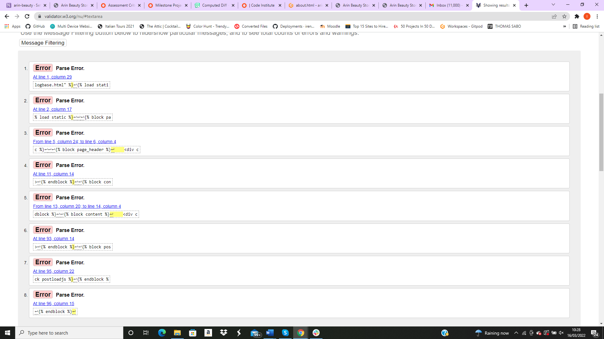
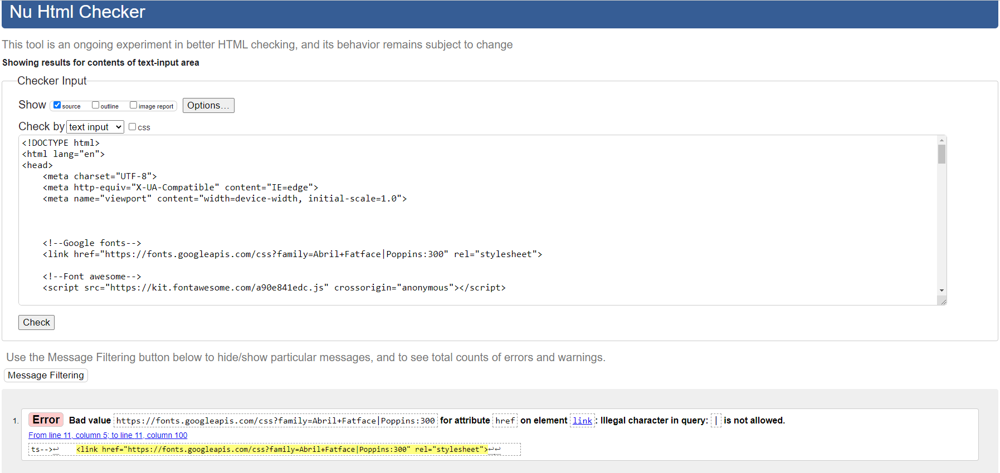
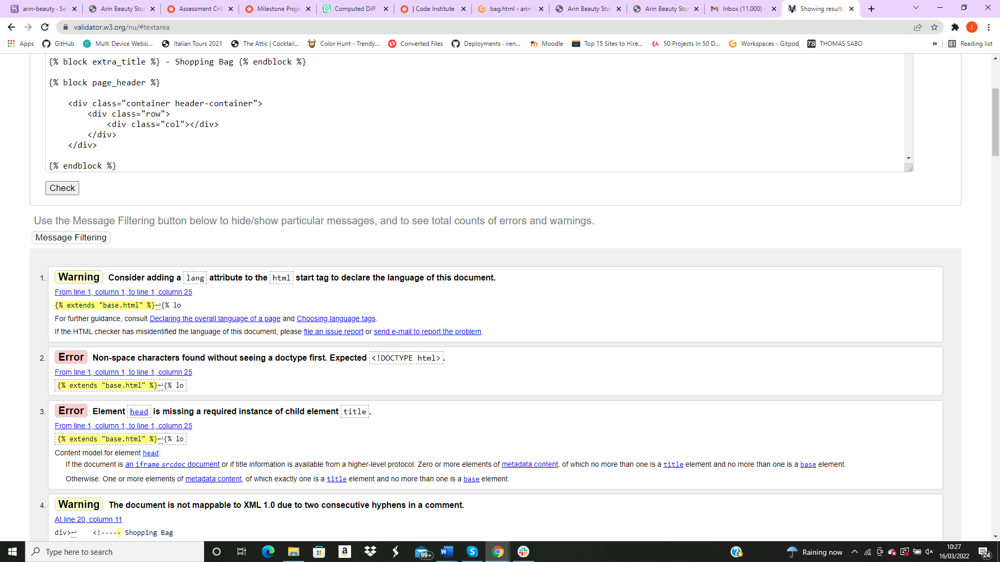
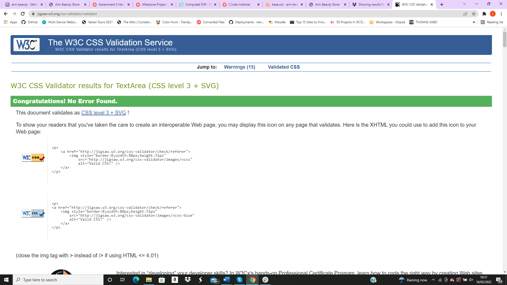
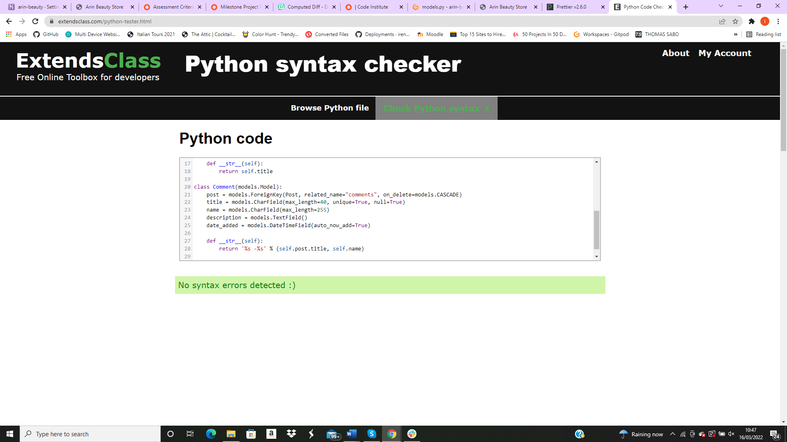

## [Testing](#testing)
  * [Code validation](#code-validation)
  * [Testing User stories](#testing-user-stories)
  * [Responsiveness and Compatibility](#responsiveness-and-compatibility)
  * [Testing performance](#testing-performance)
  * [Testing accessibility](#testing-accessibility)
  * [known bugs](#known-bugs)
### [Code Validation](#code-validation)
##All warnings on HTML are created by the python code in the file
## HTML5
All tests passed

## CSS3
All tests passed

## JavaScript
All tests passed

## Python
All tests passed

*Please Note - Warnings and errors were given on most pages due to template logic being used in this project. Certain Python files also failed PEP8 checks due to base code set by Django.*
# [Testing performance](#testing-performance)
# Responsiveness
 - The site was tested across multiple devices and screens using dev tools and my own devices. Used a hp pavilion, galaxy tab and a samsung s50.
# Security
 - I tested all pages with a non admin account to make sure that admin specific features(add/edit/delete) for blogs and products was not accessible without being an admin account holder. This was tested by me copying the links, accessing them on an incognito browser in Google Chrome that I was not logged into, then logging into it with a non-admin user, and trying the links again. The error pops up correctly and advises the user that only admins and site owners can view that page.
# General Testing For Site Functionality
* Index.html
 - On this page I have made it a large image of the store logo and a shop now button which leads into the site. This page acts as a landing page and a welcome to the site.
* Navbar
 - Navbar is positioned at top of screen and fixed there.
 - Links have been found to be working when tested.
 - Dropdowns appear for all appropiate categories and are functioning as intended. 
 - Navbar collapses on smaller screens and functions appropiately.
 - Navbar search bar functions and access correct items
 - Blog navbar functions correctly and takes user to appropiate pages
# Home
 - Home page functions as expected with large button 'shop now' leading to products page
# Products
 - All product images are displaying as expected and are responsive across screen sizes'
 - Also will display individually when clicked on with a description beside the image.
 - Edit/Delete links for admins work and direct admin to the correct pages
 - Quantity selector works correctly, by changing the amount of the product using the up/down arrows within the box, at the sides of the box and by using the up/down arrow keys on the users keyboard. Focus colours work as intended
 - Keep Shopping button hover works, and takes the user back to the products page
 - Add To Bag button adds the product to the users shopping bag in the correct size (if applicable) and quantity that the user has selected. This is displayed to the user by way of an on screen alert, showing a mini view of the users shopping bag. This was tested using a range of products with different sizes and quantities selected
 - Reviews section shows reviews that users have left, and allows both the user who submitted the review and the admin to edit the review
 - If user is logged in, a review form is displayed with the submit button below to submit the review form once they are done
# [Testing User stories](#testing-user-stories)
### First Time Users
Understand the purpose of the site
Users are shown a hero image which promote the sale of gifts on the home page
There is also an about section in the blog section which gives an account of what the site is about and how it started.
Being able to easily sign up for an account

A user can quickly and easily sign in/create an account.
I have tested this feature and found it to be working.
### Returning Users
Will have the ability to securely and swiftly log into their account

All accounts, log ins and set up is done by Django and is extremely secure
Log in process is very quick, and allows a user to save their log in details for next time
Profile page contains past orders and order confirmations
I have tested this feature and found it to be working.

When a user is logged in, if they navigate to the profile page they will be given their Order History
Here users can see their default address and change it if needs be, they can also view their previous orders in a list. They can click on each individual order for more comprehensive details of the order.
When a user urchases a product it will be saved to their profile
I have tested this feature and found it to be working.

All users, regardless of logged in status, will be able to purchase products through the site
If a user is logged in when they process an order, it will be displayed on their profile order history
All users will receive an order confirmation email directly to their email inbox

I have tested this feature and found it to be working.
Leave reviews of products

Logged in users are able to leave product reviews
On the product details page, reviews are displayed below the main product information display
User reviews are displayed at the top, and the review form is below them
### [Responsiveness and Compatibility](#responsiveness-and-compatibility)
### [known bugs](#known-bugs)
  * remove button not working in the shopping bag page, this was a typo error. When changed the remove button functioned as expected.

  * Product page would not render as I had not included 'django.template.context_processors.media' in settings.py so my product which at the time lacked an image caused the page to throw an error.

  * Server would not load and threw this error 
  File "/workspace/.pip-modules/lib/python3.8/site-packages/django/template/engine.py", line 52, in __init__
    self.builtins = self.default_builtins + builtins
    self.builtins = self.default_builtins + builtins
TypeError: can only concatenate list (not "set") to list
TypeError: can only concatenate list (not "set") to list

After searching through files I found that in the settings.py file I had added in templates, I had added 'builtins' and its contents using curly brackets instead of square brackets. This resolved the above issue but threw another error.
django.template.library.InvalidTemplateLibrary: Invalid template library specified. ImportError raised when trying to load 'crispy_forms.templatetags.crispy_forms_fields': No module named 'crispy_forms.templatetags.crispy_forms_fields' - I realised I had a spelling error and removed the stray 's' from fields. The server then operated as expected.

* AttributeError: 'Settings' object has no attribute 'STRIPE_PUBLIC_KEY' when I saved the stripe_public_key to my variables in my workspace I had a typo.
* I had forgotten to pip3 install stripe

* Remove button wasnt working because I hadnt added a reverse url to the view to go back to the updated shopping bag.

* Stript form for payment not loading correctly, this was resolved after adjusting a typo.

* Secret key was left in settings.py, after realising this i added it to the workspace for github and linked it to the project to keep it secret.

* Stripe wasnt working because I had a typo in pid. ()[0] the square bracket was outside the bracket.
when stripe was working a new error came up. this error showed that the checkout orderline wasnt functioning correctly because the site was looking for a product.size element and on my site i dont have product.sizes as it is irrelevant for my beauty product site.

the date wasnt showing on the confirmation email as i had it down as {order.order_date} instead of {order.date}

* Add product page didnt open. I used diffchecker.com to check the difference between my code and the video source code. 
### Migrations
After I had deployed my project to Heroku, I was getting issues with my migrations not being pushed to Heroku correctly. I reset my migrations, but I didn't do this correctly the first time which lead to me needing to do it twice.

To successfully reset my migrations, I deleted all previous migrations and the db.sqlite3 file from GitPod. I then re-ran migrations on GitPod and Heroku, and this fixed the issue I was having.
#### Unresolved Issues
- Product reviews linked to product ratings
I have implemented product reviews on my site, however I was unable to figure out a way to link these up to display as an average rating for the product the reviews are for. I attempted this by following tutorials but was unable to make this work and plan to resolve this issue going forward..

- Footer
I wanted to add a footer but was met with an issue when doing so. The footer tended to stay around half way down the page and wouldnt stick to the bottom despite numerous attempts. I asked on slack, stack overflow, and my mentor but ultimately due to time constraints the issue is still present. 

- Going forward I would like to break the image file into sub files for product images, blog images and readme images as it is quite a large file. 